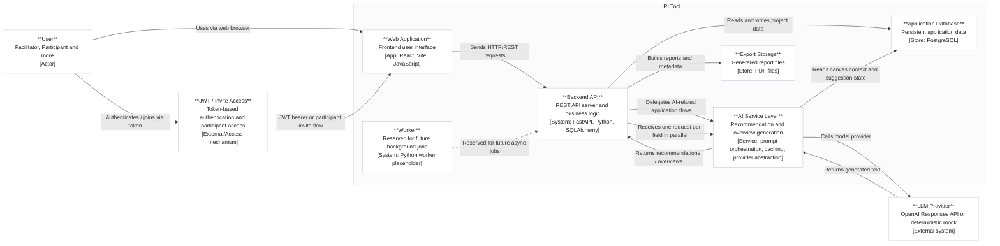

# Diagrama de Arquitetura em Estilo C4-like

## Mermaid

## Legenda Sugerida

Figure X. C4-like architectural view of the LRI Tool, showing the main actors, core application modules, persistence layer, and the integration with the language-model provider.

## Parágrafo Sugerido

We designed an architectural view of the LRI Tool following a C4-inspired representation to highlight the main actors, core components, and external integrations. The system is centered on a Web Application implemented with React and Vite, which serves as the main interaction point for facilitators and participants. The frontend communicates with a FastAPI-based Backend API responsible for business rules, workflow control, persistence orchestration, and report generation. AI-enabled features are encapsulated in a dedicated service layer behind the backend API, where prompts are built, application context is reused, and text generation is delegated to either the OpenAI Responses API or a deterministic mock provider for reproducible local execution. Persistent application data are stored in PostgreSQL, while generated reports are written as PDF artifacts. A worker component is also present in the architecture for future background processing, although the current AI workflows are request-driven. A relevant design decision is the use of parallel frontend calls for field-level AI generation, allowing recommendations and analytical overviews to be rendered progressively as soon as each response becomes available while preserving the backend as the mediation layer.

## Prompt para Gerar a Imagem

Create a clean academic software architecture diagram in the style of a C4 container diagram, similar to figures produced with Icepanel. Use a light background, subtle gray borders, rounded white boxes, and a polished paper-ready layout. The diagram title is "LRI Tool". Place a single actor on the left named "User" with the subtitle "Facilitator, Participant and more" and the tag "[Actor]". Below or near the actor, add an external access/authentication box named "JWT / Invite Access" with the subtitle "Token-based authentication and participant access" and the tag "[External/Access mechanism]".

Inside the main system boundary labeled "LRI Tool", place these containers:

- "Web Application" with subtitle "Frontend user interface" and tag "[App: React, Vite, JavaScript]"
- "Backend API" with subtitle "REST API server and business logic" and tag "[System: FastAPI, Python, SQLAlchemy]"
- "AI Service Layer" with subtitle "Recommendation and overview generation" and tag "[Service: prompt orchestration, caching, provider abstraction]"
- "Worker" with subtitle "Reserved for future background jobs" and tag "[System: Python worker placeholder]"
- "Application Database" as a database cylinder with subtitle "Persistent application data" and tag "[Store: PostgreSQL]"
- "Export Storage" as a storage/database style element with subtitle "Generated report files" and tag "[Store: PDF files]"

Outside the system boundary on the right, add an external box named "LLM Provider" with subtitle "OpenAI Responses API or deterministic mock" and tag "[External system]".

Draw these relationships with short labels:

- User -> Web Application: "Uses via web browser"
- User -> JWT / Invite Access: "Authenticates / joins via token"
- JWT / Invite Access -> Web Application: "JWT bearer or participant invite flow"
- Web Application -> Backend API: "Sends HTTP/REST requests"
- Backend API -> Application Database: "Reads and writes project data"
- Backend API -> Export Storage: "Builds reports and metadata"
- Backend API -> AI Service Layer: "Delegates AI-related application flows"
- Backend API -> AI Service Layer: "Receives one request per field in parallel"
- AI Service Layer -> Application Database: "Reads canvas context and suggestion state"
- AI Service Layer -> LLM Provider: "Calls model provider"
- LLM Provider -> AI Service Layer: "Returns generated text"
- AI Service Layer -> Backend API: "Returns recommendations / overviews"
- Worker -> Backend API: dashed arrow labeled "Reserved for future async jobs"

Keep the visual language minimal, symmetric, and suitable for a software engineering paper. Avoid bright colors. Use soft shadows only if subtle. Make the final result look like an architecture figure from an academic article.
