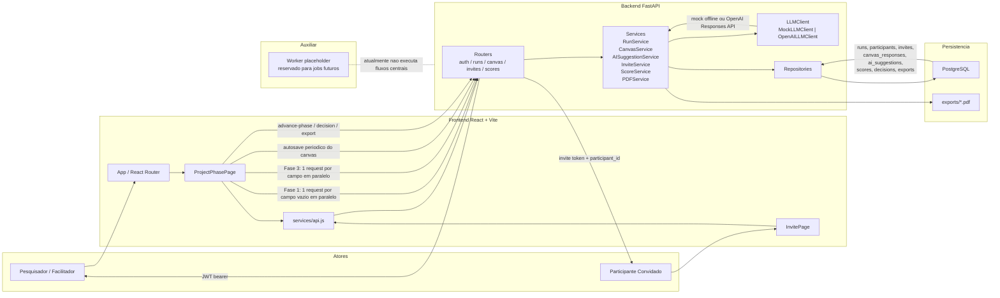
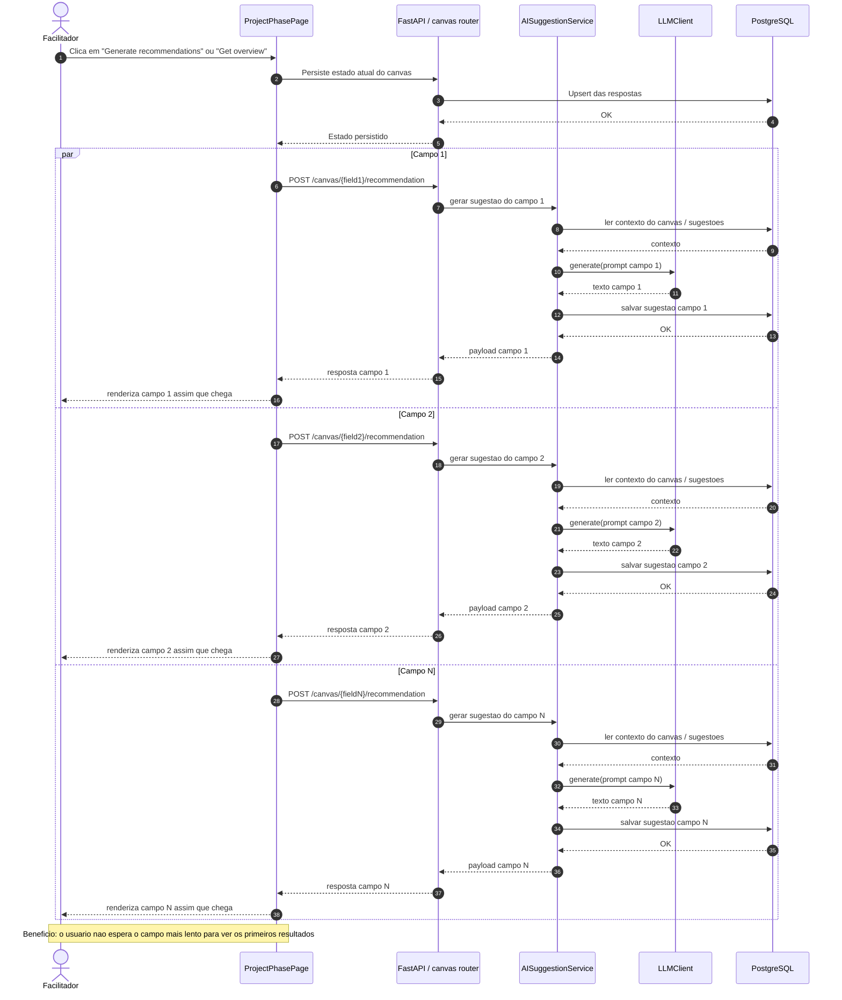

# Diagramas de Arquitetura

## Visao Geral

## Fluxo de IA em Paralelo

## Como Visualizar

- No VS Code, abra este arquivo e use `Open Preview` ou `Open Preview to the Side`.
- No GitHub, Mermaid em blocos Markdown costuma renderizar automaticamente.
- No Mermaid Live Editor, cole o conteudo deste arquivo ou apenas o bloco desejado: `https://mermaid.live`
